# 🤖 LangChain Flask Bot - RAG-Powered Technical Course Assistant

[](https://www.python.org/downloads/)
[](https://flask.palletsprojects.com/)
[](https://python.langchain.com/)
[](LICENSE)

A Flask-based intelligent chatbot that uses **Retrieval-Augmented Generation (RAG)** to answer questions about technical courses. Built with LangChain, Hugging Face models, and FAISS for efficient vector search and contextual responses.

## 🎯 **What It Does**

This application creates an AI-powered Q&A system that:
- 🌐 **Scrapes** real course data from technical websites
- 🔍 **Understands** user queries through semantic search
- 🤖 **Generates** accurate, contextual answers using AI
- ⚡ **Serves** responses via a clean REST API

## 🏗️ **Architecture Overview**

```mermaid
graph TB
    subgraph "🔧 Setup Phase"
        A1[🌐 Web Scraping<br/>Brainlox Courses] --> A2[📄 Text Processing<br/>Clean & Chunk]
        A2 --> A3[🔢 Generate Embeddings<br/>384-dimensional vectors]
        A3 --> A4[💾 FAISS Index<br/>Vector Database]
    end
    
    subgraph "🚀 Runtime Phase"
        B1[📝 User Query] --> B2[🔍 Vector Search<br/>FAISS Similarity]
        B2 --> B3[📋 Retrieved Context<br/>Relevant Chunks]
        B3 --> B4[🤖 LLM Generation<br/>Falcon 7B]
        B4 --> B5[📤 JSON Response]
    end
    
    A4 -.-> B2
    
    style A1 fill:#e3f2fd
    style B1 fill:#e8f5e8
    style B4 fill:#fff3e0
```



## 🔄 **RAG System Flow**

### **R.A.G. = Retrieval + Augmentation + Generation**

```mermaid
flowchart TD
    A[👤 User Query<br/>'What Python courses are available?'] --> B[🔍 RETRIEVAL<br/>Convert to vector & search FAISS]
    B --> C[📋 Top 3 relevant course chunks]
    C --> D[📈 AUGMENTATION<br/>Combine query + context]
    D --> E[🎯 GENERATION<br/>Falcon 7B generates answer]
    E --> F[📤 Final Response<br/>Contextual course information]
    
    style A fill:#e1f5fe
    style B fill:#f3e5f5
    style D fill:#e8f5e8
    style E fill:#fff3e0
    style F fill:#fce4ec
```



## 🛠️ **Technology Stack**

| Component | Technology | Purpose |
|-----------|------------|---------|
| **Web Framework** | Flask | REST API server |
| **AI Orchestration** | LangChain | RAG pipeline management |
| **Vector Database** | FAISS | Fast similarity search |
| **Language Model** | Falcon 7B (Hugging Face) | Text generation |
| **Embeddings** | all-MiniLM-L6-v2 | Semantic vector creation |
| **Web Scraping** | WebBaseLoader | Data collection |

## 📋 **Prerequisites**

- **Python 3.8+**
- **Hugging Face Account** (free)
- **Internet Connection** (for model access)
- **4GB+ RAM** (for embeddings)

## 🚀 **Quick Start**

### **1. Clone Repository**
```bash
git clone https://github.com/Anshuman-git-code/Langchain_Flask_Bot.git
cd Langchain_Flask_Bot
```

### **2. Set Up Environment**
```bash
# Create virtual environment
python -m venv venv

# Activate virtual environment
# On Windows:
venv\Scripts\activate
# On Mac/Linux:
source venv/bin/activate

# Install dependencies
pip install -r requirements.txt
```

### **3. Configure Environment Variables**
Create a `.env` file in the project root:
```env
HUGGINGFACEHUB_API_TOKEN=your_huggingface_token_here
USER_AGENT=TechnicalCoursesBot/1.0
```

**Get your Hugging Face token:**
1. Go to [Hugging Face](https://huggingface.co/)
2. Create account → Settings → Access Tokens
3. Create new token with "Read" permission

### **4. Generate FAISS Index**
```bash
python generate_faiss.py
```
**Expected output:**
```
Loading documents from https://brainlox.com/courses/category/technical
Splitting documents into chunks...
Generating embeddings...
Creating FAISS index...
FAISS index created successfully!
```

### **5. Start the Application**
```bash
python app.py
```
**Server will start at:** `http://localhost:5003`

## 🎮 **Usage**

### **API Endpoint**
```
POST /chat
Content-Type: application/json
```

### **Request Format**
```json
{
  "query": "What Python courses are available?"
}
```

### **Response Format**
```json
{
  "response": "Based on the available courses, here are the Python-related options: 1. Python for Beginners - covers basic syntax and programming concepts, 2. Advanced Python Development - focuses on frameworks like Django and Flask..."
}
```

### **Test with cURL**
```bash
curl -X POST http://localhost:5003/chat \
  -H "Content-Type: application/json" \
  -d '{"query": "What are the best web development frameworks?"}'
```

### **Test with Python**
```python
import requests
import json

url = "http://localhost:5003/chat"
data = {"query": "Tell me about machine learning courses"}

response = requests.post(url, json=data)
print(json.dumps(response.json(), indent=2))
```

## 🔍 **How It Works**

### **Setup Phase (generate_faiss.py)**

1. **🌐 Web Scraping**
   ```python
   loader = WebBaseLoader(["https://brainlox.com/courses/category/technical"])
   docs = loader.load()
   ```

2. **✂️ Text Chunking**
   ```python
   text_splitter = RecursiveCharacterTextSplitter(
       chunk_size=500,    # Each chunk max 500 characters
       chunk_overlap=50   # 50 characters overlap
   )
   ```

3. **🔢 Vector Embeddings**
   ```python
   embedding_model = HuggingFaceEmbeddings(
       model_name="sentence-transformers/all-MiniLM-L6-v2"
   )
   ```

4. **💾 FAISS Index Creation**
   ```python
   vectorstore = FAISS.from_documents(documents, embedding_model)
   vectorstore.save_local("faiss_index")
   ```

### **Runtime Phase (app.py)**

1. **🔍 Query Processing**
   - Convert user query to 384-dimensional vector
   - Search FAISS index for similar content

2. **📋 Context Retrieval**
   - Retrieve top 3 most relevant course chunks
   - Combine with original query

3. **🤖 AI Generation**
   - Send enhanced prompt to Falcon 7B
   - Generate contextual response

4. **📤 Response Delivery**
   - Format as JSON
   - Return to client

## 🎯 **Key Concepts**

### **What is RAG?**
**Retrieval-Augmented Generation** combines:
- **Retrieval**: Finding relevant information from a knowledge base
- **Augmentation**: Enhancing queries with retrieved context
- **Generation**: Creating responses using both query and context

### **Why RAG?**
- ✅ **Accuracy**: Responses based on real data, not hallucinations
- ✅ **Relevance**: Semantic search finds contextually similar content
- ✅ **Up-to-date**: Knowledge base can be updated without retraining
- ✅ **Transparency**: Can trace responses back to source documents

### **Vector Embeddings**
Text is converted to numerical vectors that capture semantic meaning:
```
"Python programming" → [0.1, -0.3, 0.8, 0.2, ...]
"Java development"   → [0.2, -0.2, 0.7, 0.1, ...]
```
Similar concepts have similar vectors, enabling semantic search.

### **FAISS (Facebook AI Similarity Search)**
- Ultra-fast vector similarity search
- Handles millions of vectors efficiently
- Supports various distance metrics (L2, cosine, etc.)

## 📁 **Project Structure**

```
Langchain_Flask_Bot/
├── app.py                 # Main Flask application
├── generate_faiss.py      # FAISS index generation
├── requirements.txt       # Python dependencies
├── .env                   # Environment variables
├── faiss_index/          # Generated vector database
│   ├── index.faiss       # FAISS index file
│   └── index.pkl         # Metadata
├── README.md             # This file
└── .gitignore           # Git ignore rules
```

## 🔧 **Configuration**

### **Environment Variables**
| Variable | Description | Required |
|----------|-------------|----------|
| `HUGGINGFACEHUB_API_TOKEN` | Hugging Face API token | Yes |
| `USER_AGENT` | Custom user agent string | No |

### **Model Configuration**
```python
# Embedding model (can be changed)
embedding_model = HuggingFaceEmbeddings(
    model_name="sentence-transformers/all-MiniLM-L6-v2"
)

# Language model (can be changed)
llm = HuggingFaceEndpoint(
    repo_id="tiiuae/falcon-7b-instruct",
    task="text-generation"
)
```

### **Chunking Parameters**
```python
text_splitter = RecursiveCharacterTextSplitter(
    chunk_size=500,        # Adjust based on your content
    chunk_overlap=50       # Prevent context loss
)
```

## 🚀 **Deployment Options**

### **Local Development**
```bash
python app.py
# Access at http://localhost:5003
```

### **Production Deployment**

#### **Docker**
```dockerfile
FROM python:3.9-slim

WORKDIR /app
COPY requirements.txt .
RUN pip install -r requirements.txt

COPY . .
RUN python generate_faiss.py

EXPOSE 5003
CMD ["python", "app.py"]
```

#### **AWS Lambda**
```python
from mangum import Mangum
handler = Mangum(app)
```

#### **Heroku**
```yaml
# Procfile
web: python app.py
```

## 📊 **Performance Considerations**

### **Memory Usage**
- **FAISS Index**: ~50MB for 1000 documents
- **Embedding Model**: ~100MB in memory
- **Flask App**: ~50MB base memory

### **Response Times**
- **Vector Search**: ~10-50ms
- **LLM Generation**: ~1-3 seconds
- **Total Response**: ~2-4 seconds

### **Optimization Tips**
1. **Caching**: Cache frequent queries
2. **Async Processing**: Use FastAPI for concurrent requests
3. **Index Optimization**: Use IVF or HNSW for large datasets
4. **Model Optimization**: Consider smaller models for faster inference

## 🛡️ **Security & Best Practices**

### **Environment Security**
- ✅ API keys in environment variables
- ✅ No hardcoded credentials
- ✅ .env file in .gitignore

### **Input Validation**
```python
if not user_query or not user_query.strip():
    return jsonify({"error": "No query provided"}), 400
```

### **Error Handling**
```python
try:
    response = qa.invoke(user_query)
    return jsonify({"response": response})
except Exception as e:
    logging.error(f"Error: {str(e)}")
    return jsonify({"error": "Internal server error"}), 500
```

## 🔍 **Troubleshooting**

### **Common Issues**

#### **1. FAISS Index Not Found**
```
FileNotFoundError: FAISS index directory 'faiss_index' not found
```
**Solution**: Run `python generate_faiss.py` first

#### **2. Hugging Face API Error**
```
HTTP 401: Unauthorized
```
**Solution**: Check your `HUGGINGFACEHUB_API_TOKEN` in `.env`

#### **3. Memory Issues**
```
RuntimeError: CUDA out of memory
```
**Solution**: Use CPU-only models or reduce batch size

#### **4. Slow Response Times**
- Check internet connection
- Consider using local models
- Implement caching

### **Debug Mode**
```python
# Enable debug logging
logging.basicConfig(level=logging.DEBUG)

# Run Flask in debug mode
app.run(debug=True)
```

## 📈 **Scaling & Improvements**

### **Immediate Improvements**
1. **Add caching layer** (Redis)
2. **Implement rate limiting**
3. **Add health check endpoint**
4. **Improve error messages**

### **Advanced Features**
1. **Streaming responses** for real-time feel
2. **Multiple data sources** beyond Brainlox
3. **User session management**
4. **Query analytics and logging**

### **Production Scaling**
1. **Load balancing** with multiple instances
2. **Database migration** to managed services
3. **CDN integration** for static assets
4. **Monitoring & alerting** setup

## 🧪 **Testing**

### **Unit Tests**
```python
import unittest
from app import app

class TestChatAPI(unittest.TestCase):
    def setUp(self):
        self.app = app.test_client()
    
    def test_chat_endpoint(self):
        response = self.app.post('/chat', 
            json={"query": "What is Python?"})
        self.assertEqual(response.status_code, 200)
```

### **Integration Tests**
```bash
# Test the complete pipeline
python -m pytest tests/
```

## 🤝 **Contributing**

1. Fork the repository
2. Create feature branch: `git checkout -b feature/new-feature`
3. Commit changes: `git commit -am 'Add new feature'`
4. Push to branch: `git push origin feature/new-feature`
5. Submit Pull Request

## 📚 **Learning Resources**

### **Core Concepts**
- [LangChain Documentation](https://python.langchain.com/)
- [FAISS Documentation](https://faiss.ai/)
- [Hugging Face Transformers](https://huggingface.co/docs/transformers/)

### **RAG Architecture**
- [RAG Paper](https://arxiv.org/abs/2005.11401)
- [Vector Database Guide](https://www.pinecone.io/learn/vector-database/)
- [Embedding Models Comparison](https://www.sbert.net/docs/pretrained_models.html)

## 📄 **License**

This project is licensed under the MIT License - see the [LICENSE](LICENSE) file for details.

## 🙏 **Acknowledgments**

- **LangChain** for the excellent AI framework
- **Hugging Face** for democratizing AI models
- **Facebook AI** for the FAISS library
- **Brainlox** for the course data

## 📧 **Contact**

- **GitHub**: [@Anshuman-git-code](https://github.com/Anshuman-git-code)
- **Email**: [anshuman.mohapatra04@egmail.com](anshuman.mohapatra04@egmail.com)

---

⭐ **Star this repository if you found it helpful!**

🐛 **Found a bug? [Create an issue](https://github.com/Anshuman-git-code/Langchain_Flask_Bot/issues)**

🚀 **Want to contribute? [Check our guidelines](#-contributing)**
